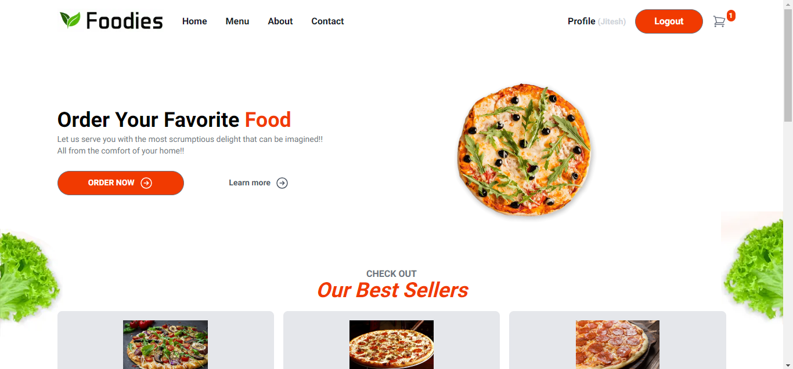

This is a Next.js 14 Food Ordering Project. The following technologies are used to build it. 
<ol><li>Next.js</li>
<li>React</li>
<li>MongoDB</li>  
<li>Amazon Web Services (AWS)</li>
<li>Stripe</li>
<li>Google Authentication</li>
<li>Typescript</li></ol>

There are two types of users: 

<strong>Users:</strong>
<ul><li>Search Food items</li>
<li>Filter Food items</li>
<li>Edit their own profile</li>
<li>Add items to cart, update items in cart, remove items from cart</li>
<li>Proceed to Buy items, do the Checkout, Shipping</li>
<li>See the list of all own orders in the Orders Section</li></ul>

<strong>Admin:</strong>
<ul><li>Create, Retrieve, Update, Delete Food items</li>
<li>Create, Retrieve, Update Users</li>
<li>See the list of all users' orders in the Orders Section</li>
<li>Search Food items</li>
<li>Filter Food items</li>
<li>Add items to cart, update items in cart, remove items from cart</li>
<li>Proceed to Buy items, do the Checkout, Shipping</li></ul>

<strong>Preview:</strong>  

